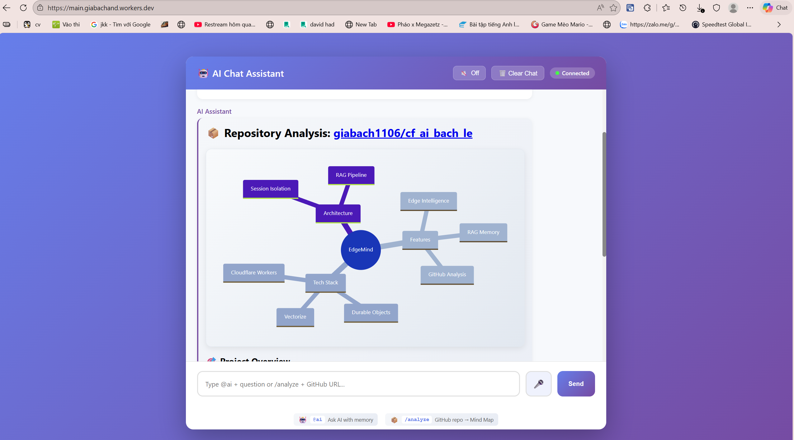
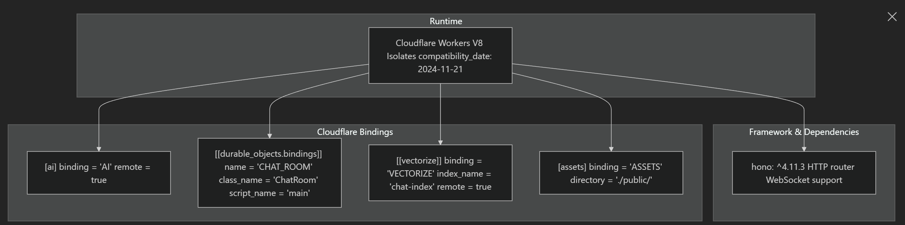
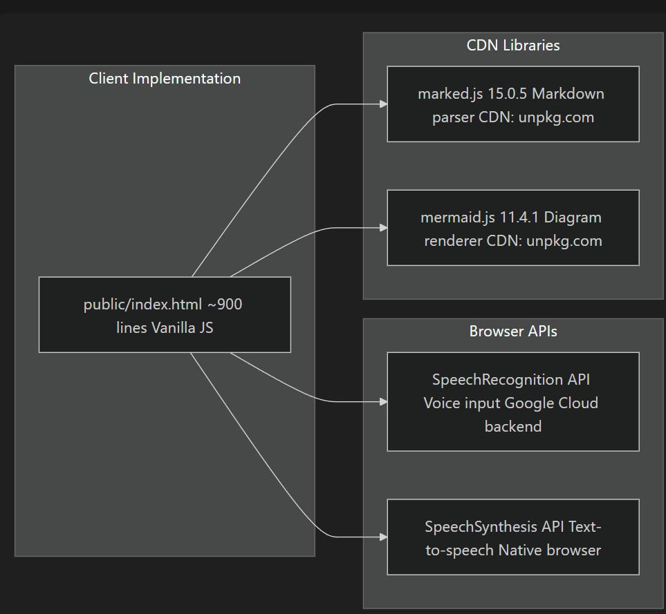
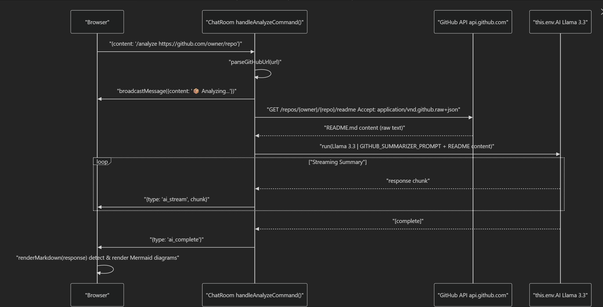
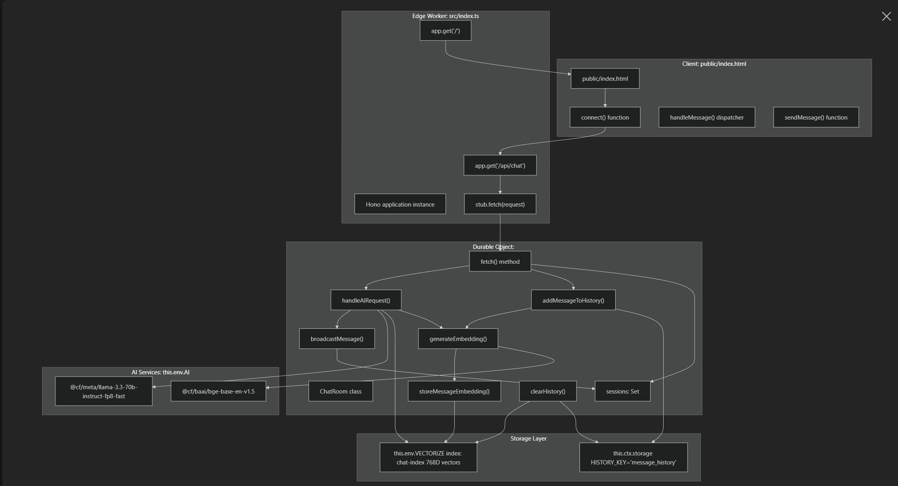

# EdgeMind: Real-Time AI Chat with RAG on Cloudflare's Edge

A serverless AI chat application built entirely on the Cloudflare Developer Platform, demonstrating production-grade integration of **Workers**, **Durable Objects**, **Workers AI**, and **Vectorize**. Each user session operates in complete isolation with its own persistent state, conversation history, and semantic memory powered by RAG (Retrieval Augmented Generation).

**Live Demo:** [https://main.giabachand.workers.dev](https://main.giabachand.workers.dev)



---

## How This Was Built

This project was developed using an iterative **vibe-coding** approach with AI assistance. Rather than writing boilerplate from scratch, I used structured prompts to architect each component incrementally—from Wrangler configuration to Durable Object state machines to streaming AI responses.

The complete engineering prompts and architectural decisions are documented in [`PROMPTS.md`](./PROMPTS.md).

**Development phases:**
1. **Configuration** — Wrangler bindings, Hono boilerplate, free-tier DO migrations
2. **Durable Object** — WebSocket session management, `this.ctx.storage` persistence
3. **AI Streaming** — Workers AI integration, async iteration over SSE chunks
4. **RAG Pipeline** — Vectorize embeddings, dual-context retrieval, prompt injection
5. **GitHub Analysis** — API integration, Mermaid mind map generation

---

## Table of Contents

- [How This Was Built](#how-this-was-built)
- [Why This Matters](#why-this-matters)
- [Technical Architecture](#technical-architecture)
- [Core Implementation Details](#core-implementation-details)
- [Features](#features)
- [Tech Stack](#tech-stack)
- [Getting Started](#getting-started)
- [Usage Guide](#usage-guide)
- [Development Notes](#development-notes)
- [Acknowledgments](#acknowledgments)

---

## Why This Matters

Traditional AI chat applications struggle with three fundamental problems:

1. **Statelessness** — HTTP Workers lose context between requests
2. **Cold Memory** — LLMs have no recall of previous conversations
3. **Global Consistency** — Maintaining session state across edge locations

EdgeMind solves all three by leveraging Cloudflare's primitives:

| Problem | Solution | Implementation |
|---------|----------|----------------|
| Statelessness | Durable Objects | `ChatRoom` class with `this.ctx.storage` persists JSON message history |
| Cold Memory | Vectorize + BGE Embeddings | 768D vectors stored per-message, queried with cosine similarity |
| Global Consistency | DO's single-threaded guarantee | `idFromName('room-{uuid}')` routes all requests to the same instance |

The result is an AI assistant that remembers what you told it yesterday, responds in under 200ms from the nearest edge location, and maintains perfect session isolation between users.

---

## Technical Architecture

### System Overview



The architecture follows a clear separation:

```
Browser (public/index.html)
    │
    ├─► WebSocket upgrade to /api/chat?room={uuid}
    │
    ▼
Edge Worker (src/index.ts) ─── Hono router
    │
    ├─► env.CHAT_ROOM.idFromName('room-{uuid}')
    │
    ▼
Durable Object (src/ChatRoom.ts)
    │
    ├─► this.ctx.storage  ─────► Message History (JSON array, capped at 100)
    ├─► this.env.AI       ─────► Llama 3.3 70B + BGE Embeddings
    └─► this.env.VECTORIZE ────► 768D vectors with roomId filter
```

### Storage Layer



**Durable Object Storage:**
- `message_history` — JSON array of `ChatMessage[]` objects
- `all_vector_ids` — Tracks inserted vector IDs for cleanup

**Vectorize Index:**
- Index name: `chat-index`
- Dimensions: 768 (BGE-base-en-v1.5 output)
- Metric: Cosine similarity
- Metadata: `{content, roomId, timestamp, messageId}`

### Session Isolation Model

Each browser generates a UUID on first visit, stored in `localStorage`:

```javascript
let roomId = localStorage.getItem('chat_room_id');
if (!roomId) {
    roomId = crypto.randomUUID();
    localStorage.setItem('chat_room_id', roomId);
}
```

This UUID routes to a unique Durable Object instance. Different users never share state, vectors, or history. The isolation is enforced at three levels:

1. **DO Instance** — `idFromName()` creates separate instances per room
2. **Vector Filter** — All Vectorize queries include `filter: {roomId}`
3. **Vector ID Namespace** — IDs use pattern `room-{uuid}_{messageId}`

---

## Core Implementation Details

### Dual-Context RAG Pipeline



When a user sends an `@ai` query, the system performs parallel context retrieval:

**1. Temporal Context (Recent Messages)**
```typescript
const recentMessages = await this.getRecentMessages(10);
```

**2. Semantic Context (Vectorize Query)**
```typescript
const queryEmbedding = await this.generateEmbedding(userQuery);
const matches = await this.env.VECTORIZE.query(queryEmbedding, {
    topK: 5,
    filter: { roomId: this.roomId },
    returnMetadata: true
});
// Filter matches with score > 0.5
```

**3. Context Injection**
```typescript
const systemPrompt = `You are a helpful AI assistant.
Current date: ${new Date().toISOString()}

Recent conversation:
${recentMessages.map(m => `${m.role}: ${m.content}`).join('\n')}

Relevant past context:
${semanticMatches.map(m => `- ${m.metadata.content}`).join('\n')}
`;
```

**4. Streaming Response**
```typescript
const stream = await this.env.AI.run('@cf/meta/llama-3.3-70b-instruct-fp8-fast', {
    messages: [{ role: 'system', content: systemPrompt }, ...history],
    stream: true,
    max_tokens: 1000
});

for await (const chunk of stream) {
    this.broadcastMessage({ type: 'ai_stream', messageId, chunk: chunk.response });
}
```

### Embedding Storage (Fire-and-Forget)

User messages are embedded asynchronously to avoid blocking the response:

```typescript
// Non-blocking: don't await
this.storeMessageEmbedding(message.id, message.content, this.roomId);

async storeMessageEmbedding(messageId: string, content: string, roomId: string) {
    const embedding = await this.generateEmbedding(content);
    const vectorId = `${roomId}_${messageId}`;
    
    await this.env.VECTORIZE.upsert([{
        id: vectorId,
        values: embedding,
        metadata: { content, roomId, timestamp: Date.now(), messageId }
    }]);
    
    // Track for cleanup
    const trackedIds = await this.ctx.storage.get('all_vector_ids') || [];
    await this.ctx.storage.put('all_vector_ids', [...trackedIds, vectorId]);
}
```

### Complete Vector Cleanup

The clear history function uses a query-all-then-delete approach since Vectorize doesn't support `deleteAll()`:

```typescript
async clearHistory() {
    // Stage 1: Query with zero vector to find all vectors in this room
    const zeroVector = new Array(768).fill(0);
    const allVectors = await this.env.VECTORIZE.query(zeroVector, {
        topK: 10000,
        filter: { roomId: this.roomId }
    });
    
    // Stage 2: Delete discovered vectors
    if (allVectors.matches.length > 0) {
        await this.env.VECTORIZE.deleteByIds(
            allVectors.matches.map(m => m.id)
        );
    }
    
    // Stage 3: Verify deletion
    const remaining = await this.env.VECTORIZE.query(zeroVector, {
        topK: 10,
        filter: { roomId: this.roomId }
    });
    
    if (remaining.matches.length > 0) {
        console.warn(`[RAG] ${remaining.matches.length} vectors still remain`);
    }
    
    // Stage 4: Clear DO storage
    await this.ctx.storage.delete('message_history');
    await this.ctx.storage.delete('all_vector_ids');
}
```

---

## Features

### AI Chat with Memory

Start any message with `@ai` to query the assistant:

```
@ai What is Cloudflare Workers?
@ai Explain the previous concept in more detail
@ai What did I ask you about yesterday?
```

The RAG system retrieves semantically similar past messages, giving the AI contextual awareness across sessions.

### GitHub Repository Analysis



Use the `/analyze` command to generate AI summaries with interactive mind maps:

```
/analyze https://github.com/cloudflare/workers-sdk
/analyze github.com/vercel/next.js
```

The system:
1. Fetches README via GitHub API (`Accept: application/vnd.github.raw+json`)
2. Streams analysis through Llama 3.3 with a specialized summarizer prompt
3. Generates Mermaid mind map diagrams
4. Renders interactive diagrams with zoom, pan, and PNG export

### Voice Interface

- **Speech Recognition:** Browser-native `SpeechRecognition` API for voice input
- **Text-to-Speech:** `SpeechSynthesis` API reads AI responses aloud
- Toggle with the microphone button in the UI

### Diagram Interactions

All Mermaid diagrams support:
- Hover to reveal zoom button
- Fullscreen modal with keyboard shortcuts (`+`/`-` zoom, `0` reset, `Esc` close)
- High-resolution PNG download

---

## Tech Stack

| Layer | Technology | Purpose |
|-------|------------|---------|
| Runtime | Cloudflare Workers | V8 isolates, global edge deployment |
| Routing | Hono 4.11.3 | Lightweight HTTP router with WebSocket support |
| State | Durable Objects | Single-threaded, persistent actor model |
| LLM | `@cf/meta/llama-3.3-70b-instruct-fp8-fast` | Text generation, 1000 max tokens |
| Embeddings | `@cf/baai/bge-base-en-v1.5` | 768D vectors for semantic search |
| Vector DB | Cloudflare Vectorize | Cosine similarity search with metadata filtering |
| Frontend | Vanilla JS + marked.js + mermaid.js | No build step, CDN-loaded libraries |

### Cloudflare Bindings (wrangler.toml)

```toml
[[durable_objects.bindings]]
name = "CHAT_ROOM"
class_name = "ChatRoom"

[[migrations]]
tag = "v1"
new_sqlite_classes = ["ChatRoom"]  # Free tier compatible

[ai]
binding = "AI"

[[vectorize]]
binding = "VECTORIZE"
index_name = "chat-index"

[assets]
directory = "./public/"
binding = "ASSETS"
```

---

## Getting Started

### Prerequisites

- Node.js 18+
- Cloudflare account (free tier works for most features)
- Wrangler CLI (`npm install -g wrangler`)

### Setup

```bash
# Clone repository
git clone https://github.com/giabach1106/cf_ai_bach_le.git
cd cf_ai_bach_le

# Install dependencies
npm install

# Login to Cloudflare
npx wrangler login

# Create Vectorize index (required for RAG)
npx wrangler vectorize create chat-index --dimensions=768 --metric=cosine

# Start development server
npm run dev
```

Open `http://localhost:8787` — the dev server connects to remote AI and Vectorize services.

### Deploy to Production

```bash
npm run deploy
```

Your worker will be available at `https://{worker-name}.{subdomain}.workers.dev`.

---

## Usage Guide

### Commands

| Command | Description |
|---------|-------------|
| `@ai {question}` | Query the AI assistant with RAG context |
| `/analyze {github-url}` | Generate repository summary with mind map |
| Clear Chat button | Deletes all history and vectors for current room |

### Session Management

- **Private by default:** Each browser gets an isolated room
- **Share a room:** Pass `?room={shared-id}` in URL
- **Reset session:** Clear `localStorage` or use incognito mode

### Debugging RAG

Check browser console for detailed logs:

```
[RAG] Generating embedding for query...
[RAG] Vectorize returned 5 matches
[RAG] Match (score: 0.847): "User mentioned they work at..."
[RAG] Injecting 3 relevant contexts into prompt
```

---

## Development Notes

### Project Structure

```
├── src/
│   ├── index.ts        # Hono app, routes, DO instantiation
│   └── ChatRoom.ts     # Durable Object: WebSocket, AI, RAG logic
├── public/
│   └── index.html      # ~900 lines vanilla JS frontend
├── wrangler.toml       # Cloudflare bindings and config
└── PROMPTS.md          # Engineering prompts used to build this
```

### Known Limitations

- **Vector limit:** Cleanup queries cap at 10,000 vectors. Rooms with >10k messages may have orphaned vectors.
- **Vectorize availability:** Requires Workers Paid plan. Free tier falls back to non-RAG responses.
- **Username persistence:** Display names update immediately but old messages retain original names.

### Type Generation

After modifying `wrangler.toml`, regenerate TypeScript types:

```bash
npm run cf-typegen
```

This updates `worker-configuration.d.ts` with the `Env` interface.

---

## Acknowledgments

Built with Cloudflare's developer platform:
- [Workers](https://developers.cloudflare.com/workers/)
- [Durable Objects](https://developers.cloudflare.com/durable-objects/)
- [Workers AI](https://developers.cloudflare.com/workers-ai/)
- [Vectorize](https://developers.cloudflare.com/vectorize/)

---

**Author:** Bach Le  
**License:** MIT
